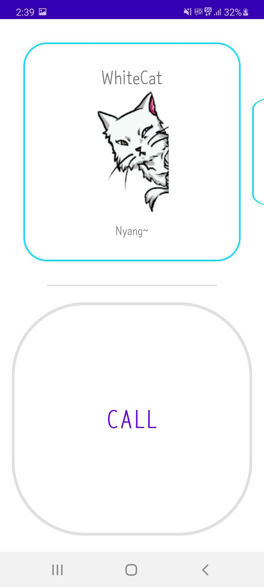

# Pocket-Assistant
Pocket Assistant for Android   
   
## Current Progress   
      
   
     
## Concept Version   
Added features as they came to mind.   
     
      
    
## QnA
Q. Why is the concept version named "crawlertest"?    
A. Cuz this PA(Pocket-Assistant) project came to mind while trying to make a crawler. Never mind.   
   
## Special thanks to   
**Character drawings**   
+ WhiteCat - [@mintchoco54](https://www.instagram.com/mintchoco54)   

